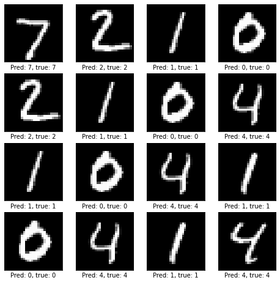

This model serves as an example of how to download, run, and modify the
contributions in the Model Zoo. For additional examples and instructions,
consult the models' GitHub repository. The model is implemented in Keras.



### Requirements

Install requirements using `pip`:


```shell
wget https://raw.githubusercontent.com/smaeland/model-zoo-mnist-example/main/requirements.txt
pip install -r requirements.txt
```

### Download the model

The model is available as a zip file:

```shell
wget https://github.com/smaeland/model-zoo-mnist-example/raw/main/cnn-model-v1.zip
unzip cnn-model-v1.zip
```

Instantiate it by calling `load_model`:
```python
import tensorflow as tf
model = tf.keras.models.load_model('cnn-model-v1')
```

### Download example data

The data is directly available through Keras:
```python
(x_train, y_train), (x_test, y_test) = tf.keras.datasets.mnist.load_data()
```

### Preprocessing

Model preprocessing involves scaling the images from [0, 255] to [0.0, 1.0].
Input data should have dimensions `(n_samples, 28, 28, 1)`. The example data
does not include the channel (last) dimension; use the snippet below to add it.

```python
x_train = x_train.astype("float32") / 255
x_test = x_test.astype("float32") / 255

x_train = tf.expand_dims(x_train, axis=-1)
x_test = tf.expand_dims(x_test, axis=-1)

y_train = tf.keras.utils.to_categorical(y_train)
y_test = tf.keras.utils.to_categorical(y_test)
```

### Run

```python
preds = model.predict(x_test)
acc = tf.keras.metrics.CategoricalAccuracy()
acc.update_state(y_test, preds)
print('Accuracy:', acc.result().numpy())
 # Accuracy: 0.991
```


### Modify

Being implemented in Keras, it is easy to fine-tune and modify the model, by
following the [Keras docs](https://keras.io/guides/transfer_learning/). A
specific example is also given in the Jupyter [notebook](https://github.com/smaeland/model-zoo-mnist-example/blob/main/run_model.ipynb)
in the models' GitHub repository.


